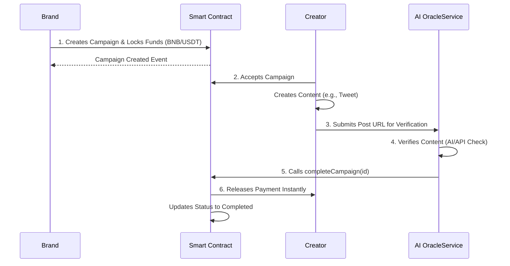

# Influencer Escrow Protocol (Amanah)

**Trust is Golden. Payments are Instant.**

Influencer-Escrow is a decentralized application (dApp) designed to solve the critical issue of late payments in the creator economy. By leveraging smart contracts and AI-powered verification, the protocol ensures that creators are paid instantly upon verifying their work, while brands can trust that funds are secure until the work is delivered.

## 🌟 Key Features

- **Smart Escrow**: Funds are locked in a smart contract upfront. No more chasing invoices.
- **AI Verification**: An automated Oracle service verifies social media posts (Twitter, Instagram, etc.) to trigger payments.
- **Instant Settlement**: Payments are released in USDT/BNB immediately upon verification.
- **Trustless**: Neither party can manipulate the outcome once the contract is deployed.

---

## 🗺️ User Journey

The following diagram illustrates the flow of a typical campaign:



---

## 🏗️ Architecture

The project is structured as a monorepo with three main components:

```mermaid
graph TD
    User[User (Brand/Creator)] --> Client[Client (Next.js App)]
    Client -->|Reads/Writes| Contract[Smart Contract (BSC Testnet)]
    Oracle[Oracle Service (Node.js)] -->|Verifies Content| Contract
    Oracle -->|API Checks| SocialMedia[Social Media APIs]
    
    subgraph "Influencer Escrow System"
        Client
        Contract
        Oracle
    end
```

### Components

1.  **Client (`packages/client`)**:
    *   **Framework**: Next.js 14 (App Router)
    *   **Styling**: Tailwind CSS + Framer Motion
    *   **Web3 Integration**: Ethers.js v6
    *   **Features**: Modern, high-performance UI with "Pitch Mode" for demos.

2.  **Smart Contract (`packages/contract`)**:
    *   **Language**: Solidity
    *   **Framework**: Hardhat
    *   **Network**: BNB Smart Chain Testnet
    *   **Logic**: Handles escrow locking, campaign management, and secure payouts.

3.  **Oracle (`packages/oracle`)**:
    *   **Environment**: Node.js
    *   **Role**: Acts as the bridge between off-chain data (social media posts) and the on-chain smart contract.
    *   **Mechanism**: Listens for verification requests and triggers the contract's completion function.

---

## 🛠️ Open-Source Dependencies

We rely on the following open-source libraries:

| Package | Purpose |
| :--- | :--- |
| **Next.js** | React framework for production-grade frontend |
| **Tailwind CSS** | Utility-first CSS framework for styling |
| **Framer Motion** | Production-ready animation library for React |
| **Lucide React** | Beautiful, consistent icons |
| **Ethers.js** | Interaction with the Ethereum/BNB blockchain |
| **Hardhat** | Development environment for Ethereum software |
| **OpenZeppelin** | Secure smart contract libraries (if applicable) |

---

## 🚀 Setup & Deployment Instructions

### Prerequisites

*   Node.js (v18+)
*   NPM or Yarn
*   MetaMask Wallet (configured for BSC Testnet)

### 1. Installation

Clone the repository and install dependencies:

```bash
git clone https://github.com/your-username/influencer-escrow.git
cd influencer-escrow

# Install dependencies for all packages advice: do it manually for each package if root install fails
cd packages/client && npm install
cd ../../packages/contract && npm install
cd ../../packages/oracle && npm install
```

### 2. Smart Contract Deployment

Deploy the contract to the BNB Smart Chain Testnet (or local Hardhat network):

```bash
cd packages/contract

# Create a .env file with your Private Key and BscScan API Key
# echo "PRIVATE_KEY=your_key" > .env

# Compile and Deploy
npx hardhat run scripts/deploy.js --network bscTestnet
```

*Note: Copy the deployed contract address. You will need it for the client configuration.*

### 3. Run the Client (Frontend)

Start the Next.js development server:

```bash
cd packages/client

# Update the contract address in your config if necessary
npm run dev
```

The app will be available at `http://localhost:3000`.

### 4. Run the Oracle Service

Start the Oracle verification server:

```bash
cd packages/oracle
npm start
```

---

## 📜 License

This project is licensed under the **MIT License**.
